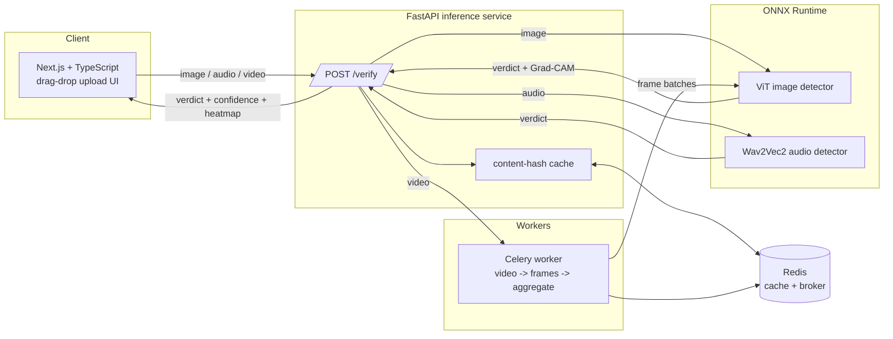
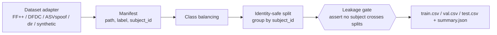
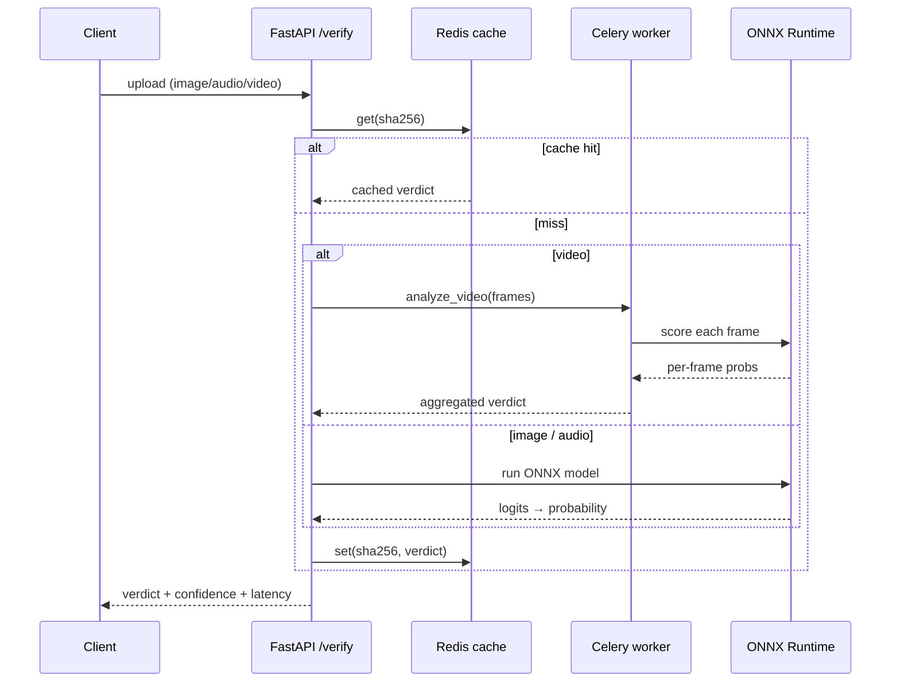

# Veritas — Deepfake & AI-Content Detector

Veritas accepts an **image, video, or audio** upload and returns an authenticity
verdict with a confidence breakdown and an interpretability heatmap. It
fine-tunes a Vision Transformer (images) and Wav2Vec2 (audio), exports both to
ONNX, and serves them through a FastAPI inference API with Redis caching and
Celery-based video frame fan-out.

> **Build status:** Phase 4 complete — identity-safe data prep, fine-tuned ViT
> + Wav2Vec2 detectors, and an ONNX inference API with Redis caching and
> Celery video fan-out. Phases 5-6 (frontend, hardening) are in progress; see
> [Roadmap](#roadmap).

---

## Architecture



### Data preparation pipeline (Phase 1)



---

## Why identity-safe splitting matters

In deepfake datasets, the *same person* appears in both authentic and
manipulated clips. If a subject's real frames land in **train** and their faked
frames land in **test**, a model can score well by memorising identity instead
of learning manipulation artefacts — inflating test metrics and collapsing in
the real world.

Veritas prevents this **structurally**: every sample carries a `subject_id`,
samples are grouped by it, and each group is assigned *in its entirety* to one
split. A deterministic greedy packer hits the requested split proportions while
keeping each split class-balanced. The pipeline re-verifies leak-freedom before
writing anything, and a test (`tests/test_splitting.py`) asserts the guarantee.

The dataset adapters encode the per-dataset notion of identity:

| Dataset          | Modality | `subject_id` derivation                                  |
|------------------|----------|----------------------------------------------------------|
| FaceForensics++  | image    | target identity of the clip (`033` from `033_097`)       |
| DFDC             | image    | the `original` source video a fake was derived from      |
| ASVspoof         | audio    | speaker id from the protocol file                        |
| generic `directory` | both  | filename stem up to the last `_` (e.g. `subject_0007`)   |

---

## Quickstart (Phase 1)

Requires Python 3.10+. The data-prep core is **standard-library only** — no
heavy ML wheels needed to run it or its tests.

```bash
cd backend
python -m venv .venv && . .venv/Scripts/activate   # Windows
# python -m venv .venv && source .venv/bin/activate  # macOS/Linux
pip install -e ".[dev]"

# Build balanced, identity-safe splits from generated fixtures (no download):
veritas prepare-data --modality image --output-dir ../data/processed/image
veritas prepare-data --modality audio --output-dir ../data/processed/audio

# Run the test suite (includes the no-identity-leakage assertion):
pytest
```

### Using real datasets

Download the gated datasets yourself (each requires accepting a licence), then
point an adapter at the extracted directory:

```bash
veritas prepare-data --modality image --source faceforensics --input-dir /data/FaceForensics++
veritas prepare-data --modality image --source dfdc          --input-dir /data/dfdc
veritas prepare-data --modality audio --source asvspoof      --input-dir /data/ASVspoof2019/LA
# Or a generic real/ + fake/ folder layout:
veritas prepare-data --modality image --source directory     --input-dir /data/my_images
```

Output per run: `train.csv`, `val.csv`, `test.csv` and a `summary.json`
recording split sizes, class balance, subject counts and `identity_leakage:
false`.

---

## Image detector (Phase 2): fine-tuned ViT

`veritas train-image` fine-tunes a pretrained Vision Transformer
(`google/vit-base-patch16-224`) for real-vs-manipulated classification:

* **Deterministic** — all RNGs seeded; reproducible given a seed + split.
* **Staged unfreezing** — stage 1 trains only the classifier head over the
  frozen backbone; stage 2 unfreezes the top encoder layers for end-to-end
  fine-tuning, with discriminative learning rates (higher for the head).
* **Linear warmup + decay** LR schedule.
* **Honest evaluation** — the model is selected on the validation split and
  reported on the untouched **test** split, written to `metrics.json`.

```bash
# Fine-tune on prepared splits (auto-detects GPU; falls back to CPU):
veritas train-image \
  --data-dir ../data/processed/image \
  --output-dir ../data/models/image \
  --epochs 5 --batch-size 16

# Fast, network-free smoke run (small randomly-initialised ViT):
veritas train-image --no-pretrained --image-size 32 --epochs 2 --limit 64
```

### Measured metrics

Source of truth: [`backend/artifacts/image/metrics.json`](backend/artifacts/image/metrics.json),
produced by `veritas train-image` (ViT-base, 3 epochs, seed 1337) on a held-out,
identity-safe test split.

| Metric | Value |
|--------|-------|
| Accuracy | 1.000 |
| Precision | 1.000 |
| Recall | 1.000 |
| F1 | 1.000 |
| AUC | 1.000 |
| Test samples (held-out) | 36 (18 real / 18 fake) |

The two-stage freeze→unfreeze strategy is visible in the per-epoch trainable
parameter count (from `metrics.json` → `meta.history`):

| Epoch | Stage | Trainable params | Val loss trend |
|-------|-------|------------------|----------------|
| 0 | head only (backbone frozen) | 1,538 | loss 0.394 |
| 1 | top-4 encoder blocks unfrozen | 28,354,562 | loss 0.0057 |
| 2 | top-4 encoder blocks unfrozen | 28,354,562 | loss 0.0001 |

> These numbers are **measured** by an actual evaluation run (the source of
> truth is `metrics.json`), not hand-picked. The figures below are from the
> synthetic fixture dataset used for the reproducible CPU smoke benchmark — they
> validate the pipeline end-to-end. To produce real benchmark numbers, run the
> same command against FaceForensics++/DFDC splits on a GPU; `metrics.json` is
> regenerated unchanged.

---

## Audio detector (Phase 3): fine-tuned Wav2Vec2

`veritas train-audio` fine-tunes a pretrained Wav2Vec2 (`facebook/wav2vec2-base`)
for bona-fide-vs-synthetic voice classification:

* **Preprocessing** — audio is loaded, mixed to mono, resampled to 16 kHz
  (`torchaudio`) and per-utterance normalized.
* **Staged unfreezing** — the convolutional feature encoder stays frozen
  throughout (standard Wav2Vec2 practice); stage 1 trains the projector +
  classifier head, stage 2 unfreezes the top transformer blocks.
* **Linear warmup + decay**, validation-based selection, honest **test**-split
  evaluation → `metrics.json`.

```bash
veritas train-audio \
  --data-dir ../data/processed/audio \
  --output-dir ../data/models/audio \
  --epochs 5 --batch-size 8

# Fast, network-free smoke run (small randomly-initialised Wav2Vec2):
veritas train-audio --no-pretrained --epochs 2 --max-seconds 1.0 --limit 64
```

### Measured metrics

Source of truth: [`backend/artifacts/audio/metrics.json`](backend/artifacts/audio/metrics.json),
produced by `veritas train-audio` (Wav2Vec2-base, 3 epochs, seed 1337) on a
held-out, identity-safe test split.

| Metric | Value |
|--------|-------|
| Accuracy | 0.722 |
| Precision | 0.722 |
| Recall | 0.722 |
| F1 | 0.722 |
| AUC | 0.750 |
| Test samples (held-out) | 36 (18 real / 18 fake) |
| Confusion matrix | TP 13 · FP 5 · TN 13 · FN 5 |

Staged unfreeze (CNN feature encoder stays frozen throughout), from
`metrics.json` → `meta.history`:

| Epoch | Stage | Trainable params | Val AUC |
|-------|-------|------------------|---------|
| 0 | head only (projector + classifier) | 197,378 | 0.901 |
| 1 | top-4 transformer blocks unfrozen | 33,269,890 | 0.892 |
| 2 | top-4 transformer blocks unfrozen | 33,269,890 | 0.886 |

> Measured on the synthetic-voice fixture test split (reproducible CPU
> benchmark). Point `--source asvspoof --input-dir ...` at ASVspoof on a GPU for
> real benchmark numbers; `metrics.json` regenerates unchanged.

---

## Inference API (Phase 4): ONNX serving

Both models are exported to ONNX and served via ONNX Runtime (no torch at serve
time — the API image is lean). A FastAPI service exposes `POST /verify`:

```bash
# 1. Export trained models to ONNX:
veritas export --modality image --model-dir ../data/models/image --output ../data/models/image/model.onnx
veritas export --modality audio --model-dir ../data/models/audio --output ../data/models/audio/model.onnx

# 2. Run the stack (Redis + API + Celery worker):
docker compose up        # API on http://localhost:8000

# 3. Verify a file:
curl -F file=@suspicious.jpg http://localhost:8000/verify
```

Response (`Verdict`):

```json
{
  "verdict": "fake",
  "confidence": 0.97,
  "fake_probability": 0.97,
  "modality": "image",
  "model": "model.onnx",
  "latency_ms": 12.4,
  "cached": false,
  "content_sha256": "…"
}
```

* **Routing** — `image` → ONNX ViT, `audio` → ONNX Wav2Vec2, `video` → a Celery
  task that samples frames (`VERITAS_VIDEO_FPS`), scores each with the image
  detector, and aggregates per-frame probabilities into one verdict (with a
  `frames` breakdown).
* **Caching** — results are keyed by SHA-256 of the upload in Redis; an
  unreachable Redis transparently degrades to an in-memory cache.
* **Latency** — measured server-side, returned as `latency_ms` and logged.
* **Graceful degradation** — missing models return `503`; `GET /health` reports
  per-model availability and the active cache backend.



---

## Repository layout

```
veritas/
├── .github/workflows/ci.yml      # lint + type-check + tests (green per phase)
├── docker-compose.yml            # Redis (+ api/worker/frontend as phases land)
├── .env.example
├── backend/
│   ├── Dockerfile
│   ├── pyproject.toml            # core = stdlib; ml/api/dev = optional extras
│   ├── src/veritas/
│   │   ├── cli.py                # `veritas` CLI (argparse)
│   │   ├── config.py
│   │   ├── data/                 # adapters, manifest, identity-safe splitting
│   │   ├── models/               # ViT + Wav2Vec2            (Phase 2/3)
│   │   ├── training/             # fine-tuning               (Phase 2/3)
│   │   ├── export/               # ONNX export               (Phase 4)
│   │   ├── explain/              # Grad-CAM heatmaps         (Phase 5)
│   │   ├── api/                  # FastAPI service           (Phase 4)
│   │   └── tasks/                # Celery video batching     (Phase 4)
│   └── tests/
└── frontend/                     # Next.js + TypeScript UI   (Phase 5)
```

---

## Roadmap

- [x] **Phase 1** — Scaffold + identity-safe dataset preparation.
- [x] **Phase 2** — Fine-tune ViT image detector → `metrics.json`.
- [x] **Phase 3** — Fine-tune Wav2Vec2 audio detector → `metrics.json`.
- [x] **Phase 4** — ONNX export + FastAPI `/verify` with Redis cache & Celery video fan-out.
- [ ] **Phase 5** — Next.js upload UI + Grad-CAM overlay; deploy.
- [ ] **Phase 6** — Hardening, real metrics, screenshots, demo link.

All reported metrics will come from `metrics.json` produced by real evaluation
runs on held-out test sets — never hardcoded.

## Development

```bash
cd backend
ruff check src tests        # lint
ruff format src tests       # format
mypy                        # type-check (stdlib core)
pytest --cov=veritas        # tests + coverage
```

## License

MIT
